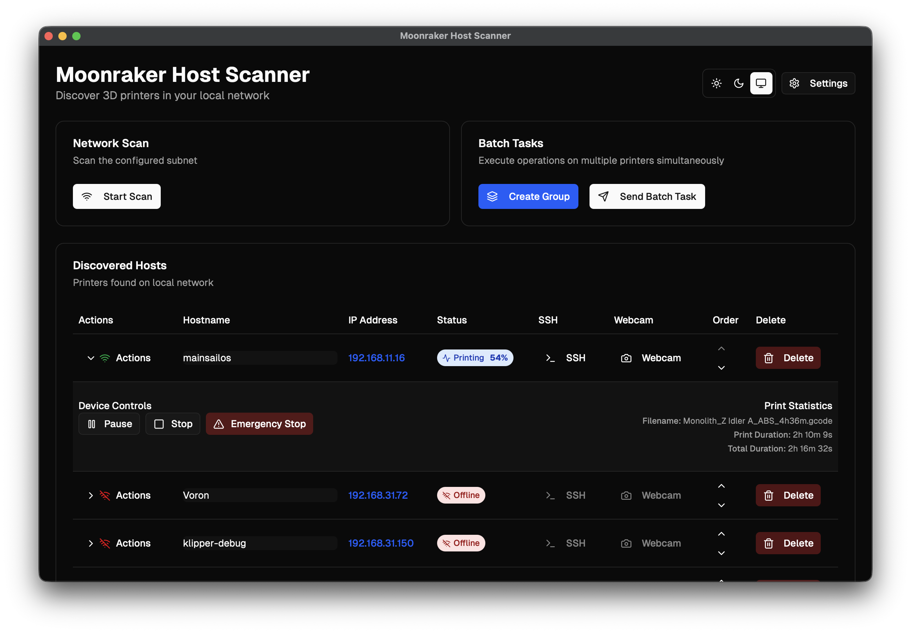

# Moonraker Host Scanner

Desktop application for discovering, monitoring, and controlling 3D printers on local networks.

## Features

- **Network Discovery** - Scan and discover 3D printer hosts
- **Real-time Monitoring** - Status updates with configurable intervals
- **Device Control** - Start, pause, stop, and emergency stop functions
- **SSH Integration** - Terminal access to hosts
- **Browser Integration** - Access to web interfaces
- **Webcam Support** - Stream printer webcams with rotation and flip controls
- **Notifications** - Configurable system notifications for status changes
- **Multi-language** - English, Russian, and German support
- **Theme Support** - Light, dark, and system themes
- **Auto-updates** - Update checking and GitHub integration
- **Print Progress** - Print job monitoring and statistics
- **Optimized Scanning** - Fast network scanning with configurable concurrency

## Screenshots

### Main Interface


### Settings Panel


### Host Details


## Quick Start

### Prerequisites

- **Node.js** 18+ 
- **pnpm** (recommended) or npm
- **Rust** 1.70+ (for Tauri)

### Installation

1. **Clone the repository**
   ```bash
   git clone https://github.com/konk22/MHS.git
   cd MoonrakerHostScanner
   ```

2. **Install dependencies**
   ```bash
   pnpm install
   ```

3. **Run in development mode**
   ```bash
   pnpm tauri:dev
   ```

4. **Build for production**
   ```bash
   pnpm tauri:build
   ```

### macOS Installation (Production Builds)

The application is not signed with an Apple Developer certificate. Remove from quarantine after installation:

1. **Download the `.dmg` file** from the latest release
2. **Mount the DMG** and drag the app to Applications
3. **Remove from quarantine** by running this command in Terminal:
   ```bash
   sudo xattr -rd com.apple.quarantine /Applications/Moonraker\ Host\ Scanner.app
   ```
4. **Launch the application**

## Usage

### Network Configuration
1. **Configure subnets** in Settings → Network tab
2. **Add custom subnet ranges** (e.g., 192.168.1.0/24)
3. **Enable/disable specific networks** for scanning

### Host Discovery
1. **Start network scan** with the scan button
2. **Review discovered hosts** in the table
3. **Customize hostnames** if needed (editable inline)
4. **Monitor real-time status** updates

### Device Monitoring
- **Automatic status updates** every 3 seconds (configurable)
- **Real-time status indicators** with color coding
- **Offline detection** (after 3 consecutive failed attempts)
- **Print progress tracking** for active print jobs
- **Print statistics** (filename, duration, progress)

### Device Control
- **Start printing** from prepared files
- **Pause/resume** active prints
- **Stop printing** safely
- **Emergency stop** for critical situations
- **Status monitoring** with real-time feedback

### System Integration
- **SSH terminal** access with configurable username
- **Web browser** integration for web interfaces
- **Webcam streaming** with refresh and controls
- **System notifications** for status changes
- **Update checking** with GitHub integration

### Advanced Features
- **Multi-language support** (EN/RU/DE)
- **Theme switching** (Light/Dark/System)
- **Auto-refresh** with configurable intervals
- **Hostname management** with reset functionality
- **Notification preferences** per status type

## Development

### Key Technologies
- **Frontend**: React 19, TypeScript, Tailwind CSS, Next.js 15
- **Backend**: Rust, Tauri 2.0
- **Build**: Vite, Next.js
- **Package Manager**: pnpm

### Architecture
- **Modular Rust backend** with separate modules for different functionality
- **React frontend** with custom hooks for state management
- **Tauri commands** for native system integration
- **Local storage** for settings and host persistence

### Development Commands
```bash
# Development
pnpm tauri:dev          # Start development server
pnpm tauri:build        # Build for production

# Code quality
pnpm lint               # Run ESLint
pnpm type-check         # Run TypeScript checks

# Version management
pnpm version:update     # Update version in all files
pnpm release            # Create release with git tag
```

## Distribution

### Build Targets
- **Windows**: `.exe` installer
- **macOS**: `.dmg` disk image (ARM64 + x86_64)
- **Linux**: AppImage (planned)

### Release Process
1. **Update version** with `pnpm version:update <version>`
2. **Create release** with `pnpm release <version> [message]`
3. **Build all targets** with `pnpm tauri:build`
4. **Create GitHub release** with assets

### CI/CD Pipeline
- **GitHub Actions** for automated builds
- **Tag-based releases** only (no branch deployments)
- **Multi-platform builds** (macOS, Windows)
- **Artifact naming** without target triple for brevity

## Documentation

### Installation Guides
- **[BUILD.md](./readme/BUILD.md)** - Build instructions and development setup
- **[ARTIFACT_NAMING.md](./readme/ARTIFACT_NAMING.md)** - Artifact naming convention
- **[macOS_INSTALLATION.md](./readme/macOS_INSTALLATION.md)** - macOS specific installation
- **[VERSIONING.md](./readme/VERSIONING.md)** - Version management and release process

## Contributing

### Development Setup
1. **Fork the repository**
2. **Create feature branch**
3. **Make changes** following coding standards
4. **Test thoroughly**
5. **Submit pull request**

### Coding Standards
- **TypeScript** for type safety
- **ESLint** for code quality
- **Prettier** for formatting
- **Conventional commits** for commit messages
- **Rust idioms** for backend code

## License

This project is licensed under the MIT License - see the [LICENSE](LICENSE) file for details.

## Support

- **Repository**: [https://github.com/konk22/MHS](https://github.com/konk22/MHS)
- **Releases**: [https://github.com/konk22/MHS/releases](https://github.com/konk22/MHS/releases)
- **Issues**: [GitHub Issues](https://github.com/konk22/MHS/issues)
- **Discussions**: [GitHub Discussions](https://github.com/konk22/MHS/discussions)
