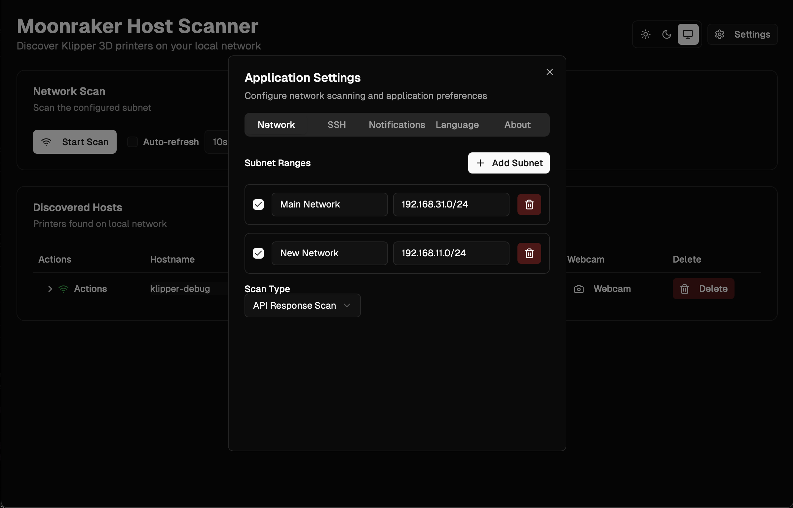
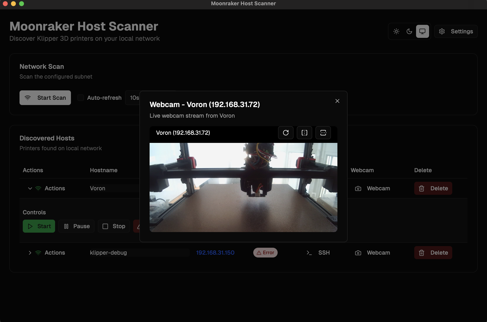

# 🖨️ Moonraker Host Scanner

A modern desktop application for discovering, monitoring, and controlling Moonraker-enabled 3D printers on your network.

## ✨ Features

- **🔍 Network Discovery** - Automatically scan and discover Moonraker hosts
- **📊 Real-time Monitoring** - Live status updates with configurable refresh intervals
- **🎮 Printer Control** - Start, pause, stop, and emergency stop functionality
- **🔗 SSH Integration** - Direct terminal access to hosts
- **🌐 Browser Integration** - Quick access to web interfaces
- **📷 Webcam Support** - Stream printer webcams
- **🔔 Smart Notifications** - Configurable system notifications for status changes
- **🌍 Multi-language** - English and Russian support
- **🎨 Theme Support** - Light, dark, and system themes

## 📸 Screenshots

### Main Interface


### Settings Panel


### Host Details


## 🚀 Quick Start

### Prerequisites

- **Node.js** 18+ 
- **pnpm** (recommended) or npm
- **Rust** 1.70+ (for Tauri)

### Installation

1. **Clone the repository**
   ```bash
   git clone <repository-url>
   cd MoonrakerHostScanner
   ```

2. **Install dependencies**
   ```bash
   pnpm install
   ```

3. **Run in development mode**
   ```bash
   pnpm tauri:dev
   ```

4. **Build for production**
   ```bash
   pnpm tauri:build
   ```

### 🍎 macOS Installation (Production Builds)

Since the application is not yet signed with an Apple Developer certificate, you'll need to remove it from quarantine after installation:

1. **Download the `.dmg` file** from the latest release
2. **Mount the DMG** and drag the app to Applications
3. **Remove from quarantine** by running this command in Terminal:
   ```bash
   sudo xattr -rd com.apple.quarantine /Applications/Moonraker\ Host\ Scanner.app
   ```
4. **Launch the application**

## 📱 Usage

### Adding Hosts
1. **Configure subnets** in Settings
2. **Start network scan**
3. **Review discovered hosts**
4. **Customize hostnames** if needed

### Monitoring
- **Automatic status updates** every 3 seconds (configurable)
- **Real-time status indicators**
- **Smart offline detection** (after 3 failed attempts)

### Printer Control
- **Start printing** from prepared files
- **Pause/resume** active prints
- **Stop printing** safely
- **Emergency stop** for critical situations

### System Integration
- **SSH terminal** access
- **Web browser** integration
- **Webcam streaming**
- **System notifications**

## 🛠️ Development

### Key Technologies
- **Frontend**: React 18, TypeScript, Tailwind CSS
- **Backend**: Rust, Tauri 2.0
- **Build**: Vite, Next.js
- **Package Manager**: pnpm

### Development Commands
```bash
# Development
pnpm tauri:dev          # Start development server
pnpm tauri:build        # Build for production

# Code quality
pnpm lint               # Run ESLint
pnpm type-check         # Run TypeScript checks

# Version management
pnpm version:update     # Update version in all files
pnpm release            # Create release with git tag
```

## 📦 Distribution

### Build Targets
- **Windows**: `.msi` installer
- **macOS**: `.dmg` disk image
- **Linux**: `.AppImage` and `.deb` packages

### Release Process
1. **Update version** with `pnpm version:update <version>`
2. **Create release** with `pnpm release <version> [message]`
3. **Build all targets** with `pnpm tauri:build`
4. **Create GitHub release** with assets

### CI/CD Pipeline
- **GitHub Actions** for automated builds
- **Tag-based releases** only (no branch deployments)
- **Multi-platform builds** (macOS, Windows)

## 📚 Documentation

### Installation Guides
- **[BUILD.md](./readme/BUILD.md)** - Build instructions
- **[ARTIFACT_NAMING.md](./readme/ARTIFACT_NAMING.md)** - Artifact naming convention

## 🤝 Contributing

### Development Setup
1. **Fork the repository**
2. **Create feature branch**
3. **Make changes** following coding standards
4. **Test thoroughly**
5. **Submit pull request**

### Coding Standards
- **TypeScript** for type safety
- **ESLint** for code quality
- **Prettier** for formatting
- **Conventional commits** for commit messages

## 📄 License

This project is licensed under the MIT License - see the [LICENSE](LICENSE) file for details.

## 📞 Support

- **Issues**: [GitHub Issues](https://github.com/your-repo/issues)
- **Discussions**: [GitHub Discussions](https://github.com/your-repo/discussions)
