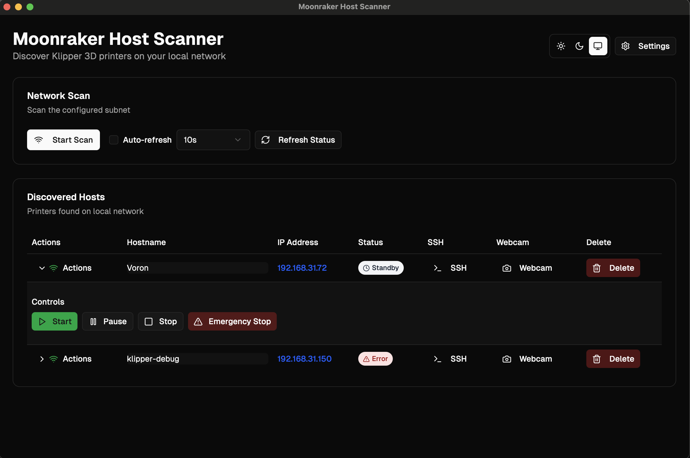
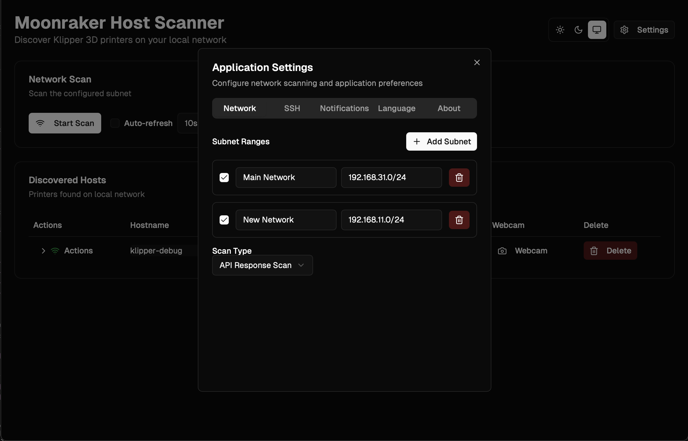
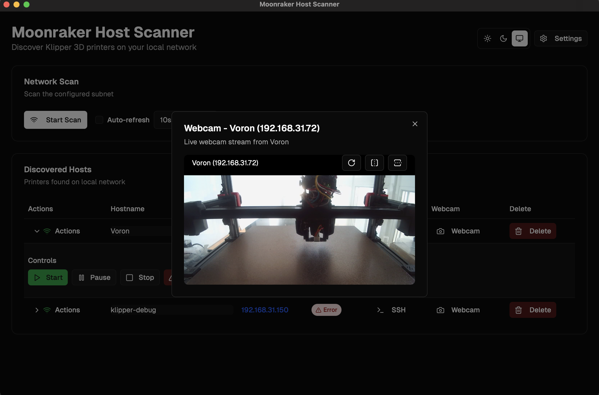

# 🖨️ Moonraker Host Scanner

Современное десктопное приложение для обнаружения, мониторинга и управления 3D-принтерами с Moonraker в вашей сети.

## ✨ Возможности

- **🔍 Обнаружение сети** - Автоматическое сканирование и обнаружение хостов Moonraker
- **📊 Мониторинг в реальном времени** - Живые обновления статуса с настраиваемыми интервалами
- **🎮 Управление принтером** - Функции запуска, паузы, остановки и аварийной остановки
- **🔗 SSH интеграция** - Прямой доступ к терминалу хостов
- **🌐 Интеграция с браузером** - Быстрый доступ к веб-интерфейсам
- **📷 Поддержка веб-камеры** - Потоковая передача веб-камер принтеров
- **🔔 Умные уведомления** - Настраиваемые системные уведомления об изменениях статуса
- **🌍 Многоязычность** - Поддержка английского и русского языков
- **🎨 Поддержка тем** - Светлые, темные и системные темы

## 📸 Скриншоты

### Главный интерфейс


### Панель настроек


### Вебкамера


## 🚀 Быстрый старт

### Требования

- **Node.js** 18+ 
- **pnpm** (рекомендуется) или npm
- **Rust** 1.70+ (для Tauri)

### Установка

1. **Клонируйте репозиторий**
   ```bash
   git clone <url-репозитория>
   cd MoonrakerHostScanner
   ```

2. **Установите зависимости**
   ```bash
   pnpm install
   ```

3. **Запустите в режиме разработки**
   ```bash
   pnpm tauri:dev
   ```

4. **Соберите для продакшена**
   ```bash
   pnpm tauri:build
   ```

### 🍎 Установка на macOS (Продакшен сборки)

Поскольку приложение еще не подписано сертификатом Apple Developer, вам нужно будет удалить его из карантина после установки:

1. **Скачайте файл `.dmg`** из последнего релиза
2. **Смонтируйте DMG** и перетащите приложение в Applications
3. **Удалите из карантина**, выполнив эту команду в Terminal:
   ```bash
   sudo xattr -rd com.apple.quarantine /Applications/Moonraker\ Host\ Scanner.app
   ```
4. **Запустите приложение**

## 📱 Использование

### Добавление хостов
1. **Настройте подсети** в Настройках
2. **Запустите сканирование сети**
3. **Просмотрите обнаруженные хосты**
4. **Настройте имена хостов** при необходимости

### Мониторинг
- **Автоматические обновления статуса** каждые 3 секунды (настраивается)
- **Индикаторы статуса в реальном времени**
- **Умное определение оффлайн** (после 3 неудачных попыток)

### Управление принтером
- **Запуск печати** из подготовленных файлов
- **Пауза/возобновление** активных печатей
- **Безопасная остановка** печати
- **Аварийная остановка** для критических ситуаций

### Системная интеграция
- **SSH терминал** доступ
- **Интеграция с браузером**
- **Потоковая передача веб-камеры**
- **Системные уведомления**

## 🛠️ Разработка

### Ключевые технологии
- **Frontend**: React 18, TypeScript, Tailwind CSS
- **Backend**: Rust, Tauri 2.0
- **Сборка**: Vite, Next.js
- **Менеджер пакетов**: pnpm

### Команды разработки
```bash
# Разработка
pnpm tauri:dev          # Запуск сервера разработки
pnpm tauri:build        # Сборка для продакшена

# Качество кода
pnpm lint               # Запуск ESLint
pnpm type-check         # Проверка TypeScript

# Управление версиями
pnpm version:update     # Обновление версии во всех файлах
pnpm release            # Создание релиза с git тегом
```

## 📦 Распространение

### Цели сборки
- **Windows**: `.exe` установщик
- **macOS**: `.dmg` образ диска

### Процесс релиза
1. **Обновите версию** с помощью `pnpm version:update <версия>`
2. **Создайте релиз** с помощью `pnpm release <версия> [сообщение]`
3. **Соберите все цели** с помощью `pnpm tauri:build`
4. **Создайте GitHub релиз** с артефактами

### CI/CD Pipeline
- **GitHub Actions** для автоматической сборки
- **Релизы только по тегам** (без деплоя веток)
- **Мультиплатформенная сборка** (macOS, Windows)

## 📚 Документация

### Руководства по установке
- **[BUILD.md](./readme/BUILD.md)** - Инструкции по сборке
- **[ARTIFACT_NAMING.md](./readme/ARTIFACT_NAMING.md)** - Соглашение об именовании артефактов

## 🤝 Участие в разработке

### Настройка разработки
1. **Форкните репозиторий**
2. **Создайте ветку функции**
3. **Внесите изменения**, следуя стандартам кодирования
4. **Тщательно протестируйте**
5. **Отправьте pull request**

### Стандарты кодирования
- **TypeScript** для типобезопасности
- **ESLint** для качества кода
- **Prettier** для форматирования
- **Conventional commits** для сообщений коммитов

## 📄 Лицензия

Этот проект лицензирован под MIT License - см. файл [LICENSE](LICENSE) для подробностей.

## 📞 Поддержка

- **Issues**: [GitHub Issues](https://github.com/your-repo/issues)
- **Discussions**: [GitHub Discussions](https://github.com/your-repo/discussions)

