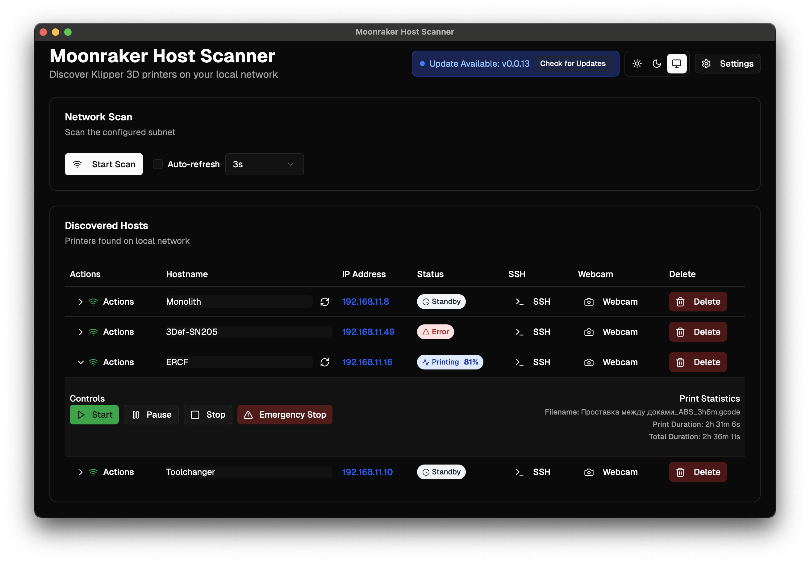
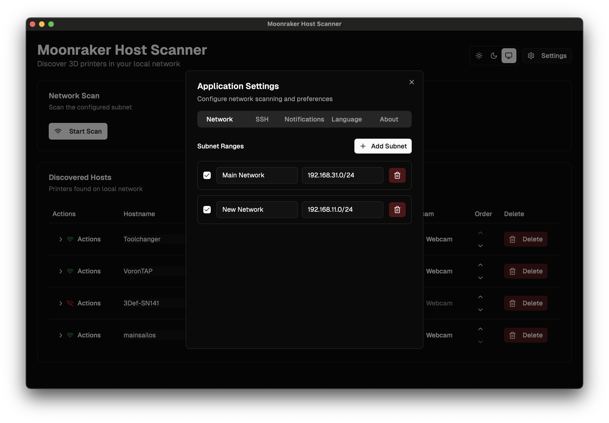
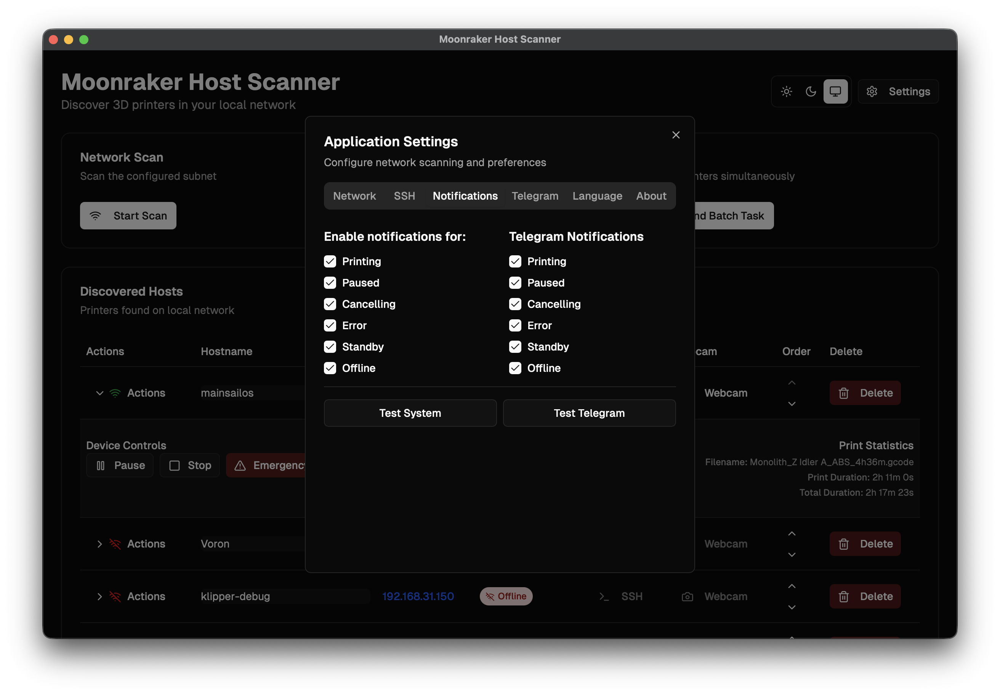
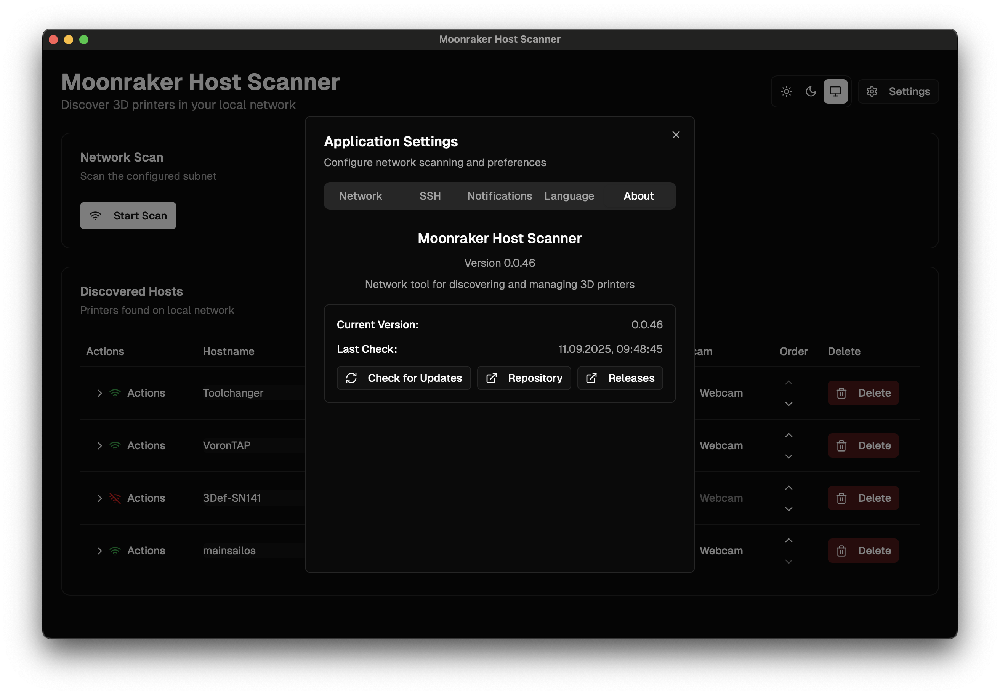
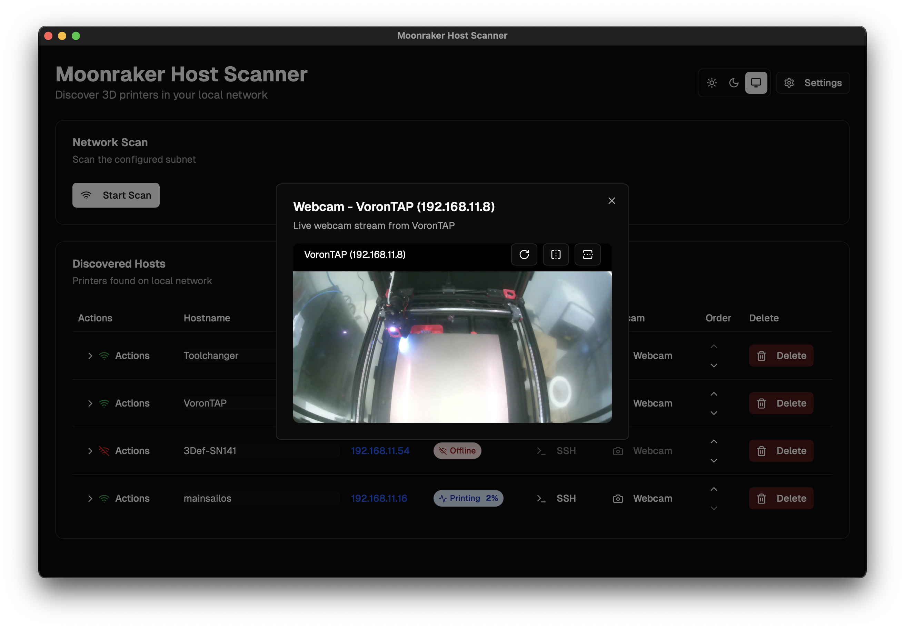

# Moonraker Host Scanner

Десктопное приложение для обнаружения, мониторинга и управления 3D-принтерами в локальных сетях.

## Возможности

- **Обнаружение сети** - Сканирование и обнаружение 3D-принтеров
- **Мониторинг в реальном времени** - Обновления статуса с настраиваемыми интервалами
- **Управление устройством** - Функции запуска, паузы, возобновления, остановки и аварийной остановки
- **SSH интеграция** - Доступ к терминалу хостов
- **Интеграция с браузером** - Доступ к веб-интерфейсам
- **Поддержка веб-камеры** - Потоковая передача веб-камер с поворотом и отражением
- **Уведомления** - Настраиваемые системные уведомления об изменениях статуса
- **Фоновый режим** - Продолжение мониторинга и уведомлений при закрытом окне
- **Системный трей** - Сворачивание в системный трей с полной функциональностью
- **Многоязычность** - Поддержка английского, русского и немецкого языков
- **Поддержка тем** - Светлые, темные и системные темы
- **Автообновления** - Проверка обновлений и интеграция с GitHub
- **Прогресс печати** - Мониторинг заданий печати и статистика
- **Оптимизированное сканирование** - Быстрое сканирование сети с настраиваемой конкурентностью
- **Сохранение хостов** - Известные хосты сохраняются при сканировании даже в оффлайн
- **Пользовательские имена** - Редактирование и настройка отображаемых имен хостов
- **Ручная сортировка** - Перетаскивание для изменения порядка хостов
- **Интеграция с Telegram ботом** - Удаленный мониторинг и управление через Telegram бота

## Скриншоты

### Главный интерфейс


### Панель настроек




### Детали хоста


## Быстрый старт

### Требования

- **Node.js** 18+ 
- **pnpm** (рекомендуется) или npm
- **Rust** 1.70+ (для Tauri)

### Установка

1. **Клонируйте репозиторий**
   ```bash
   git clone https://github.com/konk22/MHS.git
   cd MoonrakerHostScanner
   ```

2. **Установите зависимости**
   ```bash
   pnpm install
   ```

3. **Запустите в режиме разработки**
   ```bash
   pnpm tauri:dev
   ```

4. **Соберите для продакшена**
   ```bash
   pnpm tauri:build
   ```

### Установка на macOS (Продакшен сборки)

Приложение не подписано сертификатом Apple Developer. Удалите из карантина после установки:

1. **Скачайте файл `.dmg`** из последнего релиза
2. **Смонтируйте DMG** и перетащите приложение в Applications
3. **Удалите из карантина**, выполнив эту команду в Terminal:
   ```bash
   sudo xattr -rd com.apple.quarantine /Applications/Moonraker\ Host\ Scanner.app
   ```
4. **Запустите приложение**

### Настройка Telegram бота

1. **Создайте бота** через [@BotFather](https://t.me/botfather) в Telegram
2. **Получите токен** бота от BotFather
3. **Настройте бота** в приложении:
   - Откройте настройки приложения
   - Перейдите на вкладку "Telegram Bot"
   - Введите токен бота
   - Нажмите "Start Bot"
4. **Зарегистрируйтесь** в боте:
   - Найдите вашего бота в Telegram
   - Отправьте команду `/start`
   - Введите код регистрации из приложения
   - Начните использовать бота для мониторинга принтеров

## Использование

### Настройка сети
1. **Настройте подсети** в Настройки → Вкладка Сеть
2. **Добавьте пользовательские диапазоны подсетей** (например, 192.168.1.0/24)
3. **Включите/отключите конкретные сети** для сканирования

### Обнаружение хостов
1. **Запустите сканирование сети** кнопкой сканирования
2. **Просмотрите обнаруженные хосты** в таблице
3. **Настройте имена хостов** при необходимости (редактируемые в строке)
4. **Мониторьте обновления статуса** в реальном времени

### Мониторинг устройств
- **Автоматические обновления статуса** каждые 3 секунды (настраивается)
- **Индикаторы статуса в реальном времени** с цветовым кодированием
- **Определение оффлайн** (после 3 последовательных неудачных попыток)
- **Отслеживание прогресса печати** для активных заданий печати
- **Статистика печати** (имя файла, продолжительность, прогресс)

### Управление устройством
- **Запуск печати** из подготовленных файлов
- **Пауза/возобновление** активных печатей
- **Отмена печати** безопасно
- **Аварийная остановка** для критических ситуаций
- **Мониторинг статуса** с обратной связью в реальном времени
- **Кнопка возобновления** появляется когда принтер на паузе

### Системная интеграция
- **SSH терминал** доступ с настраиваемым именем пользователя
- **Интеграция с браузером** для веб-интерфейсов
- **Потоковая передача веб-камеры** с обновлением и элементами управления
- **Системные уведомления** об изменениях статуса
- **Фоновый мониторинг** с интеграцией системного трея
- **Проверка обновлений** с интеграцией GitHub

### Расширенные возможности
- **Поддержка нескольких языков** (EN/RU/DE)
- **Переключение тем** (Светлая/Темная/Системная)
- **Ручное сканирование** - Без автообновления, только ручное сканирование сети
- **Управление именами хостов** с пользовательскими именами
- **Настройки уведомлений** для каждого типа статуса
- **Фоновый режим** с настраиваемыми интервалами мониторинга
- **Системный трей** с опциями показа/скрытия/выхода
- **Сохранение хостов** - Оффлайн хосты остаются в списке

### Использование Telegram бота
- **Просмотр списка хостов** - Получите список всех обнаруженных принтеров
- **Мониторинг статуса** - Просматривайте текущий статус каждого принтера
- **Детальная информация** - Получайте информацию о текущем задании печати
- **Управление печатью** - Останавливайте печать с подтверждением
- **Перезагрузка firmware** - Перезагружайте firmware принтера
- **Просмотр веб-камеры** - Получайте снимки с камер принтеров
- **Открытие в браузере** - Быстрый доступ к веб-интерфейсу принтера
- **Экстренная остановка** - Аварийная остановка с дополнительным подтверждением

### Интеграция с Telegram ботом
- **Удаленный мониторинг** - Просмотр статуса принтера и прогресса печати из любого места
- **Управление хостами** - Просмотр и выбор хостов через интерактивные меню
- **Управление печатью** - Запуск, пауза, остановка и экстренная остановка печати удаленно
- **Доступ к веб-камере** - Просмотр потоков веб-камер принтеров прямо в Telegram
- **Управление firmware** - Перезагрузка firmware принтера удаленно
- **Интеграция с браузером** - Открытие веб-интерфейсов принтеров прямо из Telegram
- **Аутентификация пользователей** - Безопасная система регистрации с кодами подтверждения
- **Обновления в реальном времени** - Живые обновления статуса и мониторинг прогресса печати
- **Интерактивные меню** - Интуитивная навигация с встроенными клавиатурами
- **Многоязычная поддержка** - Интерфейс бота на английском, русском и немецком языках

## Разработка

### Ключевые технологии
- **Frontend**: React 19, TypeScript, Tailwind CSS, Next.js 15
- **Backend**: Rust, Tauri 2.0
- **Telegram Bot**: Rust, teloxide crate
- **Сборка**: Vite, Next.js
- **Менеджер пакетов**: pnpm

### Архитектура
- **Модульный Rust backend** с отдельными модулями для различной функциональности
- **React frontend** с пользовательскими хуками для управления состоянием
- **Tauri команды** для нативной системной интеграции
- **Интеграция Telegram бота** с безопасной аутентификацией пользователей
- **Фоновый мониторинг** с интеграцией системного трея
- **Кроссплатформенная совместимость** (Windows, macOS, Linux)
- **Локальное хранилище** для настроек и персистентности хостов

### Команды разработки
```bash
# Разработка
pnpm tauri:dev          # Запуск сервера разработки
pnpm tauri:build        # Сборка для продакшена

# Качество кода
pnpm lint               # Запуск ESLint
pnpm type-check         # Проверка TypeScript

# Управление версиями
pnpm version:update     # Обновление версии во всех файлах
pnpm release            # Создание релиза с git тегом
```

## Распространение

### Цели сборки
- **Windows**: `.exe` установщик
- **macOS**: `.dmg` образ диска (ARM64 + x86_64)
- **Linux**: AppImage (планируется)

### Процесс релиза
1. **Обновите версию** с помощью `pnpm version:update <версия>`
2. **Создайте релиз** с помощью `pnpm release <версия> [сообщение]`
3. **Соберите все цели** с помощью `pnpm tauri:build`
4. **Создайте GitHub релиз** с артефактами

### CI/CD Pipeline
- **GitHub Actions** для автоматической сборки
- **Релизы только по тегам** (без деплоя веток)
- **Мультиплатформенная сборка** (macOS, Windows)
- **Именование артефактов** без target-triple для краткости

## Документация

### Руководства по установке
- **[BUILD.md](./readme/BUILD.md)** - Инструкции по сборке и настройке разработки
- **[ARTIFACT_NAMING.md](./readme/ARTIFACT_NAMING.md)** - Соглашение об именовании артефактов
- **[macOS_INSTALLATION.md](./readme/macOS_INSTALLATION.md)** - Специфичная для macOS установка
- **[VERSIONING.md](./readme/VERSIONING.md)** - Управление версиями и процесс релиза

## Участие в разработке

### Настройка разработки
1. **Форкните репозиторий**
2. **Создайте ветку функции**
3. **Внесите изменения**, следуя стандартам кодирования
4. **Тщательно протестируйте**
5. **Отправьте pull request**

### Стандарты кодирования
- **TypeScript** для типобезопасности
- **ESLint** для качества кода
- **Prettier** для форматирования
- **Conventional commits** для сообщений коммитов
- **Rust идиомы** для backend кода

# Проект под лицензией CC BY-NC 4.0

Автор: **Тормышев Игорь (konk22)**  
Лицензия: **Creative Commons Attribution-NonCommercial 4.0 International (CC BY-NC 4.0)**

---

## 📄 Условия использования

- Вы можете свободно использовать, изучать, изменять и распространять данный код.  
- **Коммерческое использование запрещено.**  
- При любом использовании необходимо **сохранять имя автора и ссылку на лицензию**.  
- Если вы модифицируете код, укажите, что были внесены изменения.  
- Запрещено применять технические или юридические меры, ограничивающие свободу, предоставленную этой лицензией.

Полный текст лицензии доступен по ссылке:  
👉 [https://creativecommons.org/licenses/by-nc/4.0/](https://creativecommons.org/licenses/by-nc/4.0/)

## Поддержка

- **Репозиторий**: [https://github.com/konk22/MHS](https://github.com/konk22/MHS)
- **Релизы**: [https://github.com/konk22/MHS/releases](https://github.com/konk22/MHS/releases)
- **Issues**: [GitHub Issues](https://github.com/konk22/MHS/issues)
- **Discussions**: [GitHub Discussions](https://github.com/konk22/MHS/discussions)

